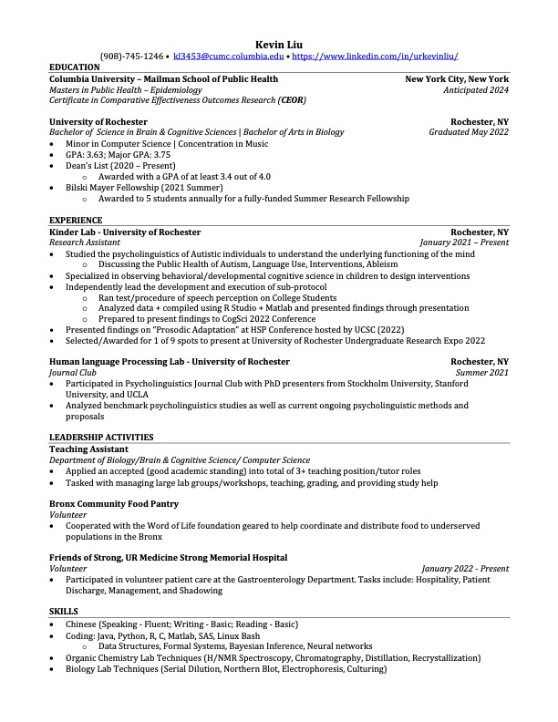

# Academic Experiences

After completing my undergraduate at University of Rochester with a major in Biology and Cognitive Sciences, I continue to pursue my career goal in medicine by attending the 2-year MPH program at Columbia Mailman School of Public Health at Columbia University Irving Medical Center to enrich my pre-med experience and find my true passion in medicine. 

# Professional Experiences - Resume
